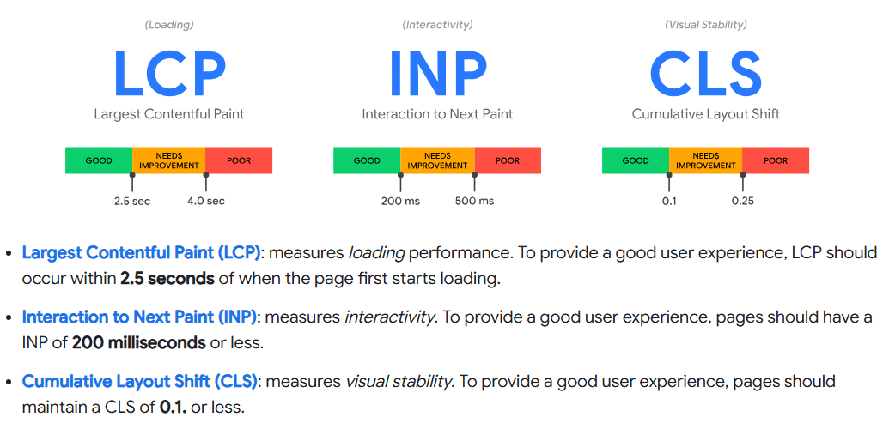

## What is SEO?
**SEO** stands for **Search Engine Optimization**. It’s the practice of making your website better so it shows up higher in search results on Google or other search engines.

## How Can I Improve SEO?
To improve SEO, you can:
- Use relevant **keywords** in your content.
- Make your website **fast** and **mobile-friendly**.
- Improve your **content quality** to be useful and engaging.
- Get other websites to **link to your site** (backlinks).
- Make sure your site is **easy to navigate** and well-structured.

## What is Lighthouse and Its Use?
**Lighthouse** is a tool from Google that helps you check how well your website is doing in areas like speed, accessibility, SEO, and performance. It gives you suggestions to make your website better.

## What is Core Web Vitals?
**Core Web Vitals** are important measurements used by Google to check how good the user experience is on your website. These include:
- **LCP** (Largest Contentful Paint)
- **CLS** (Cumulative Layout Shift)
- **INP** (Interaction to Next Paint)

### Explanation of Core Web Vitals:
1. **LCP (Largest Contentful Paint)**  
   Measures how long it takes for the main content (like a big image or text) to load. The faster, the better. Aim for **under 2.5 seconds**.

2. **CLS (Cumulative Layout Shift)**  
   Measures how much the page moves around while loading. Too much movement is bad. Aim for **below 0.1**.

3. **INP (Interaction to Next Paint)**  
   Measures how quickly the page reacts after you click something. A fast response improves user experience. Aim for **under 200 ms**.

